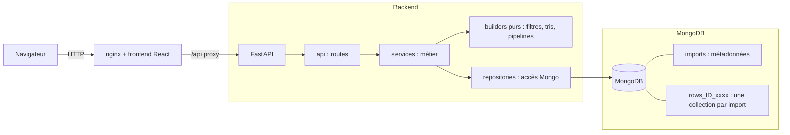

# Test Technique - Datahub simplifié

Application web de gestion d'imports de données (CSV / XLSX) inspirée de Datahub : import, exploration paginée, tri, filtres, édition unitaire et par lot, statistiques par colonne. Conçue pour des imports allant jusqu'à **1 000 000 de lignes**.

- **Backend** : Python 3.13, FastAPI, Pandas, MongoDB (PyMongo async), géré avec `uv`
- **Frontend** : React + TypeScript (voir section Frontend, *WIP*)
- **Infra** : Docker, un unique `docker-compose.yml`, configuration par fichiers `.env`

> Statut : le backend est complet et testé. Le frontend est en cours de développement.

---

## Sommaire

- [Test Technique - Datahub simplifié](#test-technique---datahub-simplifié)
  - [Sommaire](#sommaire)
  - [1. Architecture](#1-architecture)
    - [Couches du backend](#couches-du-backend)
  - [2. Choix techniques](#2-choix-techniques)
    - [Règles de typage](#règles-de-typage)
    - [Import : `replace` et `append`](#import--replace-et-append)
    - [Autres décisions de comportement](#autres-décisions-de-comportement)
  - [3. Lancement](#3-lancement)
    - [Développement local du backend](#développement-local-du-backend)
    - [Générer des fichiers de test](#générer-des-fichiers-de-test)
  - [4. API](#4-api)
    - [Format du flux NDJSON](#format-du-flux-ndjson)
    - [Sélection multiple](#sélection-multiple)
  - [5. Modèle de données MongoDB](#5-modèle-de-données-mongodb)
  - [6. Index MongoDB : stratégie et justification](#6-index-mongodb--stratégie-et-justification)
  - [7. Optimisations](#7-optimisations)
  - [8. Mesures de performance](#8-mesures-de-performance)
  - [9. Stratégie de tests](#9-stratégie-de-tests)
  - [10. CI](#10-ci)
  - [11. Limitations connues](#11-limitations-connues)
  - [12. Frontend](#12-frontend)

---

## 1. Architecture



### Couches du backend

```
backend/app/
  api/            Routes HTTP : parsing, injection
  services/       Règles métier et orchestration
    type_detection.py    règles de typage + accumulateur par colonne
    type_conversion.py   chaîne -> valeur typée, comptage des rejets
    query_builder.py     filtres/tri -> requête Mongo
    mutation_builder.py  sélection / actions -> $set, $in, $nin
    stats_builder.py     pipelines d'agrégation et parsing des résultats
    file_reader.py       Lecture CSV/XLSX par chunks Pandas
    ingestion.py         replace / append, rollback
    indexing.py          index à la demande en tâche de fond
  repositories/   Seule couche qui parle à MongoDB
  schemas/        Modèles Pydantic (entrées/sorties)
  core/           Config (pydantic-settings), connexion, index de base
```

Principes appliqués :

- **Aucune logique métier dans les routes** : une route valide, appelle un service, traduit les erreurs.
- **Builders** : la traduction « filtre -> requête Mongo » et « statistiques -> pipeline » est faite par des fonctions sans I/O, testables unitairement sans base.
- **Repositories** : les services restent testables avec des faux repositories en mémoire.
- **Erreurs métier** : les services lèvent des exceptions de domaine, un seul context manager (`http_errors`) les traduit en HTTP.

---

## 2. Choix techniques

| Sujet | Choix | Pourquoi |
|---|---|---|
| Client Mongo | `AsyncMongoClient` (PyMongo ≥ 4.9) | Async natif |
| Une collection par import | `rows_<import_id>_<uuid8>` | La limite de 64 index par collection serait vite atteinte avec une collection partagée ; suppression et remplacement d'un import triviaux |
| Clés techniques `c0, c1…` | Les noms réels vivent dans `imports.columns` | Les en-têtes peuvent contenir `.`, `$` ou des espaces, problématiques comme noms de champs Mongo |
| Valeurs typées natives | `bool`, `int`, `double`, `string`, vide = `null` | Tris et agrégations corrects côté Mongo |
| Lecture fichier | `pandas.read_csv(dtype=str, chunksize=…)` | Mémoire bornée ; Pandas ne devine rien, le typage est le nôtre |
| Détection des types | Fichier **entier** en streaming, accumulateur à 4 drapeaux par colonne | Pas d'échantillon qui raterait une valeur invalide en fin de fichier ; mémoire constante |
| Pagination | `skip/limit` | Permet « aller à la page N » ; limite assumée sur les `skip` profonds |
| Grandes pages (1 M, 10 M) | Streaming NDJSON | Jamais 10 M d'objets en mémoire côté serveur |
| Sélection multiple | Mode `ids` ou mode `filter` + `excluded_ids` | « Tout sélectionner » sur le résultat filtré sans jamais matérialiser 1 M d'identifiants |
| Persistance de l'état UI | URL + localStorage (frontend) | Pas de besoin backend, état partageable par URL |
| Un Dockerfile par service | `backend/Dockerfile`, `frontend/Dockerfile` | Plus propre qu'un Dockerfile unique ; un seul `docker-compose.yml` lance tout |

### Règles de typage

- Types : `boolean`, `integer`, `float`, `string`. Repli sur `string` si indéterminable ou colonne entièrement vide.
- **Booléens** (insensible à la casse) : `true/false`, `oui/non`, `1/0`, rien d'autre.
- Une colonne ne contenant que `0` et `1` est donc `boolean` ; un `2` la rend `integer`. L'utilisateur peut corriger le type avant l'import.
- **Flottants** : point ou virgule décimale (`3,5`), sans séparateur de milliers. `1.0` n'est pas un entier.
- **Vides** : `""`, espaces, `nan`, `null`, `none` pour les colonnes typées. Pour une colonne `string`, seules les valeurs blanches sont vides (un texte « null » reste du texte).
- Entiers bornés à 64 bits (limite MongoDB).

### Import : `replace` et `append`

| | `replace` | `append` |
|---|---|---|
| Colonnes du fichier | Libres | Doivent correspondre à celles de l'import (par nom, ordre libre) |
| Types | Détectés puis corrigeables | **Figés** |
| Écart de colonnes | n/a | Refus `409` listant colonnes manquantes et en trop, rien n'est écrit |
| Valeur non convertible | `null` + rapport par colonne | `null` + rapport par colonne |

- **Atomicité du `replace`** : les nouvelles lignes sont insérées dans une **nouvelle collection**. Une fois tout chargé, un seul `find_one_and_update` (atomique) rebascule `rows_collection`, puis l'ancienne collection est supprimée. Par exemple, un échec à la ligne 800 000 supprime la nouvelle collection et l'import reste intact.
- **Rollback de l'`append`** : chaque ajout est marqué par un `ingest_id` ; en cas d'échec, `delete_many({ingest_id})`.
- Le rapport d'import (valeurs rejetées par colonne) est stocké dans `imports.last_import`.

### Autres décisions de comportement

- **Édition unitaire** : une valeur invalide renvoie `422` (l'utilisateur peut corriger), contrairement à l'import qui met `null` et rapporte.
- **« Supprimer la valeur »** (édition multiple) : mise à `null`, la ligne reste.
- **Statistiques** : les valeurs vides sont **exclues** de `count` et des pourcentages, et comptées à part (`empty_count`). Pourcentages arrondis à 2 décimales. La checkbox 2 ne s'applique qu'aux colonnes `string`.
- **Filtres** : combinés en ET. Opérateurs : string `equals`, `contains`, `starts_with` ; numérique `equals`, `gt`, `lt`, `between` ; booléen `equals` ; `is_empty` / `is_not_empty` pour tous.

---

## 3. Lancement

Prérequis : Docker avec le plugin compose.

```bash
# Développement
ENV_FILE=.env.dev docker compose --env-file .env.dev up -d --build

# Préproduction
ENV_FILE=.env.preprod docker compose --env-file .env.preprod up -d --build

# Production
ENV_FILE=.env.prod docker compose --env-file .env.prod up -d --build
```

`--env-file` alimente l'interpolation du compose, `ENV_FILE` est injecté dans les conteneurs (`env_file:`).

> Les trois fichiers `.env.dev`, `.env.preprod`, `.env.prod` sont versionnés pour faciliter l'évaluation : **ils ne contiennent aucun vrai secret et doivent être remplacés par des fichiers `*.example` pour un usage réel**.

| Variable | Rôle |
|---|---|
| `MONGO_URI`, `MONGO_DB` | Connexion à MongoDB |
| `MONGO_INITDB_ROOT_USERNAME/PASSWORD` | Compte root initial de Mongo |
| `CORS_ORIGINS` | Origines autorisées (liste séparée par des virgules) |
| `IMPORT_CHUNK_SIZE` | Lignes par chunk à l'import (défaut 50 000) |
| `MAX_UPLOAD_MB` | Taille maximale d'un fichier (défaut 500) |
| `LOG_LEVEL`, `APP_ENV` | Journalisation et environnement |

Documentation interactive de l'API : `/docs` (Swagger).

### Développement local du backend

```bash
cd backend
uv sync
uv run uvicorn app.main:app --reload
uv run pytest tests/unit -q
uv run ruff check .
```

### Générer des fichiers de test

Un script de génération de fichiers de test est disponible si besoin, sous `backend/scripts/generate_csv.py`.

```bash
cd backend
uv run python scripts/generate_csv.py --rows 1000 --out small.csv
uv run python scripts/generate_csv.py --rows 1000000 --out big.csv
uv run python scripts/generate_csv.py --rows 1000 --delimiter ";" --decimal-comma --out fr.csv
uv run python scripts/generate_csv.py --rows 100000 --out sample.xlsx
```

Les fichiers sont écrits dans `backend/output/` (non versionnés).

---

## 4. API

| Méthode | Route | Rôle |
|---|---|---|
| `GET` | `/health` | Santé de l'API et de Mongo |
| `GET` / `POST` | `/imports` | Lister / créer |
| `GET` / `PATCH` / `DELETE` | `/imports/{id}` | Détail / renommer / supprimer (métadonnées et lignes) |
| `PUT` | `/imports/reorder` | Réordonner (liste complète des ids) |
| `POST` | `/imports/detect-types` | Détection des types d'un fichier (sans état, rien n'est stocké) |
| `POST` | `/imports/{id}/data` | Import `replace` ou `append`, avec rapport |
| `POST` | `/imports/{id}/rows/query` | Page de lignes (10 à 10 000) avec filtres, tri, total |
| `POST` | `/imports/{id}/rows/stream` | Page en streaming NDJSON (jusqu'à 10 000 000) |
| `PATCH` | `/imports/{id}/rows/{row_id}` | Édition d'une ligne |
| `POST` | `/imports/{id}/rows/batch-update` | Édition multiple (`keep` / `set` / `clear` par colonne) |
| `POST` | `/imports/{id}/rows/batch-delete` | Suppression multiple |
| `POST` | `/imports/{id}/stats` | Statistiques d'une colonne |

### Format du flux NDJSON

```
{"meta":{"total":1000000,"returned":1000000,"page":1,"page_size":10000000,"indexing":[]}}
{"id":"…","values":{"c0":1,"c1":"x"}}
…
{"done":1000000}
```

- Les erreurs de validation (`404`, `422`) sont de **vraies réponses HTTP**, car la validation et le total sont calculés avant le premier octet.
- Une fois le flux démarré, le statut 200 est parti : un flux se termine par `{"done": n}` (succès) ou `{"error": …}`. L'absence de `done` signale un flux tronqué.
- `page_size` est plafonné au reste réel des données.

### Sélection multiple

```json
{ "mode": "ids", "ids": ["…"] }
{ "mode": "filter", "filters": [], "excluded_ids": ["…"] }
```

Le mode `filter` sans filtre cible tout l'import : l'interface devra demander une confirmation.

---

## 5. Modèle de données MongoDB

Collection `imports` :

```json
{
  "_id": "ObjectId",
  "name": "Ventes 2025",
  "description": "…",
  "order": 3,
  "columns": [{ "key": "c0", "name": "Prix", "type": "float" }],
  "rows_collection": "rows_<import_id>_<uuid8>",
  "row_count": 1000000,
  "indexed_columns": ["c0"],
  "last_import": { "mode": "append", "filename": "…", "at": "…", "rows_inserted": 1000,
                   "rejected": [{ "column": "Prix", "count": 12 }] },
  "created_at": "…", "updated_at": "…"
}
```

Collection `rows_<import_id>_<uuid8>` (une par import) :

```json
{ "_id": "ObjectId", "ingest_id": "uuid (append uniquement)", "d": { "c0": 12.5, "c1": null } }
```

Le rapport de rejets est une **liste** et non un dictionnaire, car les noms de colonnes peuvent contenir des points.

---

## 6. Index MongoDB : stratégie et justification

| Index | Collection | Créé | Justification |
|---|---|---|---|
| `_id` | rows | Automatique | Ordre par défaut et départage des tris |
| `idx_imports_order` `{order: 1}` | imports | Au démarrage | Page d'accueil triée par ordre manuel |
| `idx_d_cN` `{d.cN: 1, _id: 1}` | rows | **À la demande** | Tri, filtres sélectifs et agrégations sur la colonne `cN` |

Raisonnement :

- **Pas d'index par colonne à l'import.** Indexer toutes les colonnes d'un fichier de 1 M de lignes multiplierait le temps d'import et l'espace disque, pour des colonnes sur lesquelles personne ne triera peut-être jamais. L'index est créé en **tâche de fond** à la première requête qui l'exploite (tri, filtre indexable, statistiques) ; cette première requête s'exécute quand même, sans index. La réponse expose `indexing: [clés]` pour informer le client.
- **`_id` en second champ de l'index.** Sans départage unique, `skip/limit` peut chevaucher ou perdre des lignes quand beaucoup de valeurs sont égales. Le départage `_id` suit **la même direction que le tri** : MongoDB ne sait lire un index à l'envers que si *tous* ses champs sont inversés. Un seul index sert donc les tris croissant et décroissant.
- **`contains` n'est pas indexable** (regex non ancrée, insensible à la casse) : aucun index n'est créé pour lui. `starts_with` est ancré et sensible à la casse pour pouvoir utiliser l'index.
- **Plafond** : MongoDB limite à 64 index par collection (`_id` compris). Le code s'arrête à 60 colonnes indexées ; au-delà, les requêtes fonctionnent sans index.
- **Cycle de vie** : un `replace` crée une nouvelle collection, donc les index à la demande repartent de zéro (`indexed_columns` est réinitialisé). L'état des builds en cours est en mémoire du processus.
- **Coût en écriture** : modifier une colonne indexée met à jour l'index pour chaque ligne touchée (voir limitations).

---

## 7. Optimisations

**Import**
- Lecture par chunks Pandas (`chunksize`), mémoire bornée quelle que soit la taille du fichier.
- Regex précompilées, conversion colonne par colonne (boucle serrée) puis assemblage des documents.
- Travail bloquant (Pandas, conversion) exécuté dans un thread (`asyncio.to_thread`) : l'event loop reste réactive pendant un import de 1 M de lignes.
- `insert_many(ordered=False)` par chunk.
- Détection en un seul passage avec sortie anticipée une fois tous les types écartés.

**Lecture**
- Pagination serveur, projection (`ingest_id` jamais renvoyé).
- Total sans filtre lu depuis le compteur `row_count` (pas de `count` sur 1 M de documents) ; total filtré calculé **en parallèle** de la page (`asyncio.gather`).
- Index composé créé à la demande, tri possible sur disque (`allowDiskUse`) en attendant.
- Streaming : curseur Mongo par lots de 5 000, flush réseau par paquets de 2 000 lignes, fermeture du curseur à la déconnexion du client (`aclosing`), `X-Accel-Buffering: no` pour nginx.

**Statistiques**
- Un seul `$group` calcule count, min, max, moyenne et compteurs booléens.
- `$facet` : page et totaux du tableau valeur/occurrence en une seule passe.
- Les filtres sur la **valeur** sont poussés **avant** le `$group` (donc indexables) ; seuls les filtres sur l'**occurrence** restent après.
- Résumé et tableau exécutés en parallèle.

**Modifications**
- Édition multiple : un seul `update_many` ; mode `filter` avec `$nin` sans jamais matérialiser les identifiants.
- `row_count` maintenu par `$inc` pour garder le total sans filtre exact.

**Frontend** (*à compléter* : debounce, virtualisation, lecture incrémentale du flux).

---

## 8. Mesures de performance

Jeu de données : 1 000 000 de lignes × 9 colonnes (généré par `scripts/generate_csv.py`), MongoDB 7 en conteneur, backend en conteneur Docker. 
Machine : *Windows 11*, CPU: *AMD Ryzen 7 5700X*, disque SSD. 
`IMPORT_CHUNK_SIZE=50000`.

| Opération | Résultat |
|---|---|
| `detect-types` (fichier de 1 M de lignes) | 5,3 s |
| Import `replace` (détection incluse) | 20,4 s |
| Mémoire du backend pendant l'import | ~100 → ~200 Mo, stable ; CPU ~100 % (un cœur) |
| Tri décroissant d'une colonne float, sans index | 1,65 s |
| Même tri, avec index | 0,19 s |
| Total filtré (`category = books`, 124 855 lignes), avec index | 0,25 s |
| Édition multiple (124 855 lignes sélectionnées) | 2,4 s |
| Statistiques d'une colonne (1 M de lignes) | 1,4 à 2,6 s |
| Flux NDJSON de 1 000 000 de lignes | 11 à 14 s, mémoire backend plate |
| Page de 10 000 lignes, page 1 puis page 90 (`skip` = 890 000) | 0,43 s puis 0,73 s |

Remarques :

- Le CPU à 100 % pendant l'import vient du Python mono-thread (GIL), pas de MongoDB. Deux imports simultanés se partageraient ce cœur ; la piste serait un `ProcessPoolExecutor` ou plusieurs workers.
- Pour les statistiques, l'index apporte peu : un `$group` sur tout le million de lignes lit de toute façon 1 M d'entrées. L'index sert surtout les tris et les filtres sélectifs.

**Preuve d'utilisation de l'index** (`explain("executionStats")` sur 1 M de lignes, tri sur `c2`, `limit(20)`) :

| Requête | Plan | Clés examinées | Documents examinés | Temps |
|---|---|---|---|---|
| Tri desc avec index `idx_d_c2` | IXSCAN → FETCH → LIMIT | 20 | 20 | 3 ms |
| Même tri, collection scan forcé (`hint $natural`) | COLLSCAN → SORT | 0 | 1 000 000 | 1 280 ms |
| Filtre `category = books` avec `idx_d_c6` | IXSCAN → FETCH → LIMIT | 20 | 20 | < 1 ms |
| Tri asc avec le même index | IXSCAN → FETCH → LIMIT | 20 | 20 | < 1 ms |
| Tri `c2` desc / `_id` asc (directions mixtes) | COLLSCAN → SORT | 0 | 1 000 000 | 515 ms |

Un même index `(d.c2, _id)` sert le tri croissant et décroissant à condition que `_id` suive la direction de la colonne. Avec des directions mixtes, MongoDB ne peut plus lire l'index et retombe sur un parcours complet suivi d'un tri : c'est la raison du départage `_id` de même direction.

> Reproductible avec `backend/scripts/explain_indexes.js`
---

## 9. Stratégie de tests

| Niveau | Outils | Contenu |
|---|---|---|
| Unitaires backend | pytest | Détection de types, conversion, lecture CSV/XLSX (séparateurs, encodage, BOM, en-têtes), builders de filtres/tri/pagination, builders de statistiques, builders de mutations, services avec **faux repositories**, encodage NDJSON |
| Intégration backend | pytest + httpx (`ASGITransport`) + **vrai MongoDB** | Endpoints FastAPI de bout en bout : CRUD, détection, import `replace`/`append`, requêtes, édition, batch, statistiques, streaming |
| Unitaires frontend | Vitest + React Testing Library | *à compléter* |
| Intégration frontend | Vitest + React Testing Library | *à compléter* |

Choix notables :

- **Vrai MongoDB pour l'intégration** (pas de `mongomock`) : les agrégations, les index et les opérateurs doivent être validés par le vrai moteur.
- Les tests d'intégration refusent de tourner sur une base dont le nom ne finit pas par `_test` (la fixture supprime la base à la fin).
- Les builders sont des fonctions pures : les tests unitaires de filtres et de statistiques n'ont besoin ni de base ni de fichier.
- Seuil de couverture : **70 % minimum**, mesuré séparément pour le backend et pour le frontend. Couverture backend actuelle : *95%*.

Lancer les tests :

```bash
# Unitaires, en local
cd backend && uv run pytest tests/unit -q

# Suite complète (unitaires + intégration) dans Docker, avec couverture
ENV_FILE=.env.dev docker compose --env-file .env.dev --profile test run --rm --build backend-test

# Seulement l'intégration
ENV_FILE=.env.dev docker compose --env-file .env.dev --profile test run --rm --build backend-test \
  uv run --no-sync pytest tests/integration
```

Le Dockerfile du backend est multi-stage : `base` (dépendances de production), `test` (ajoute les dépendances de dev et les tests) et `prod` (code seul, utilisateur non-root). Le service `backend-test` du compose est sous le profil `test` : il ne démarre pas avec un `up` classique.

---

## 10. CI

Workflow GitHub Actions (`.github/workflows/ci.yaml`) :

- **backend** : `ruff`, `pytest` avec un service MongoDB réel et `--cov-fail-under=70` ;
- **docker** : validation du `docker-compose.yml` et build de l'image `prod` (sans push).

Le CD (déploiement) n'est pas mis en place faute d'environnement cible. Évolution possible : push des images vers un registre et déploiement preprod/prod.

---

## 11. Limitations connues

**Import**
- Les colonnes composées uniquement de `0` et `1` sont typées `boolean` (règle `0/1` retenue). Corriger le type avant l'import si besoin ; en `append`, le type est figé et les valeurs incompatibles deviennent `null` avec rapport.
- Une colonne entièrement vide est typée `string`.
- XLSX : seule la **première feuille** est lue. `openpyxl` (mode `read_only`) est le chemin le plus lent ; les dates arrivent en `string`, et un entier stocké comme `1.0` par Excel est détecté en `float`.
- CSV : les en-têtes dupliqués sont renommés silencieusement par Pandas (`a`, `a.1`) ; les en-têtes vides sont rejetés pour XLSX. Détection du séparateur par heuristique (`csv.Sniffer`), pouvant se tromper sur de très petits fichiers.
- Pas de séparateur de milliers dans les nombres.
- La détection est sans état : le fichier est envoyé deux fois (détection puis import).
- La limite de taille (`MAX_UPLOAD_MB`) ne protège que l'application ; la vraie limite se règle au niveau du reverse proxy.

**Concurrence**
- Les ingestions simultanées sur un même import ne sont pas sérialisées : un `replace` concurrent d'un `append` peut perdre l'ajout.
- Une modification concurrente d'un `replace`, ou une édition pendant un flux, n'est pas isolée.
- L'état des builds d'index est en mémoire : perdu au redémarrage (la requête suivante relance le build). Un `replace` pendant un build peut laisser une collection d'index orpheline.

**Lecture**
- `skip` profond coûteux sur très gros volumes (pas de pagination par curseur, incompatible avec « aller à la page N »).
- `contains` est une regex insensible à la casse, sans index ; `starts_with` est sensible à la casse.
- Un tri/filtre sur une colonne pas encore indexée est plus lent la première fois ; au-delà de 60 colonnes indexées, plus d'index.
- Un seul critère de tri à la fois.
- Flux NDJSON : le total et les lignes ne proviennent pas du même instantané ; un client très lent garde un curseur ouvert (timeout d'inactivité de 10 minutes côté Mongo). Les pages de 1 M et 10 M sont un cas d'exercice, pas un usage réaliste.
- Les statistiques déclenchent un index sur la colonne analysée, y compris pour un booléen (deux valeurs distinctes : index peu sélectif, gain négligeable pour un `$group` qui lit tout de même toutes les entrées). Amélioration possible : ne pas indexer les colonnes booléennes, ou n'indexer pour les statistiques que lorsqu'un filtre sélectif est appliqué.

**Statistiques**
- Les filtres sur l'occurrence (post-`$group`) ne peuvent pas utiliser d'index.
- Un `$group` sur une colonne à très forte cardinalité (≈ 1 M de valeurs distinctes) est coûteux et peut passer par le disque.
- Avec la checkbox 2, le résumé et le tableau font deux passes sur les données.

**Modifications**
- Les opérations multiples sont atomiques par document, pas globalement : une erreur au milieu laisse un état partiel.
- Modifier une colonne indexée coûte une mise à jour d'index par ligne modifiée.
- Les listes d'identifiants d'une sélection sont plafonnées à 100 000 (le mode `filter` n'a pas cette limite).

**Général**
- Pas d'authentification (hors périmètre du sujet).
- Pas de transactions multi-documents (coûteuses sur 1 M de lignes) ; l'atomicité repose sur l'écriture d'un seul document `imports` et sur les collections de génération.

---

## 12. Frontend

*À compléter : architecture (`pages / components / hooks / services / types`), persistance de l'état (URL + localStorage), debounce, virtualisation du tableau, lecture incrémentale du flux NDJSON, tests Vitest et Testing Library, Dockerfile multi-stage (build puis nginx avec proxy vers le backend).*